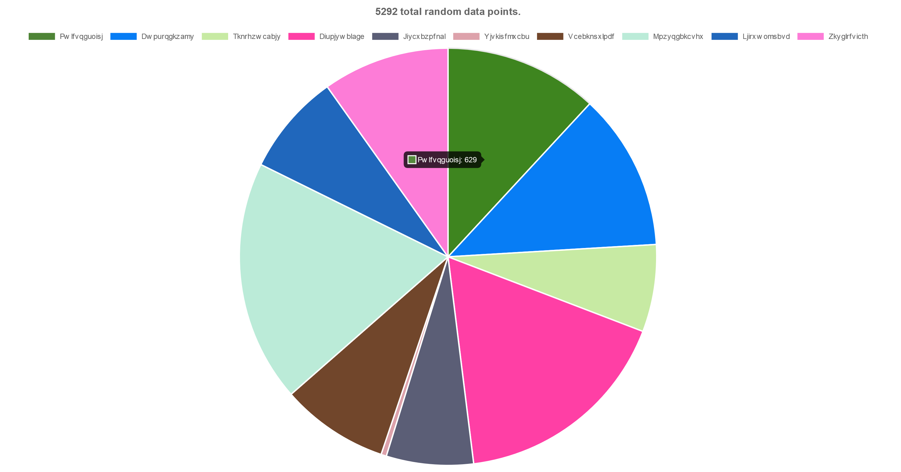

# Islandora Repository Reports

## Introduction

A Drupal 8 module that provides a collection of reports on various aspects of an Islandora repository. This module's goal is to provide Islandora repository administrators with a set of visual reports that work with little, or no, configuration. It is not a replacment for Views.

Reports included in this module are:

* number of nodes, grouped by collection
* number of nodes, grouped by Drupal content type
* number of nodes, grouped by month created
* number of nodes, grouped by terms from the Islandora Models taxonomy
* number of nodes, grouped by terms from the Islandora Genre taxonomy
* number of media, grouped by MIME type
* number of media, grouped by Islandora Media Use taxonomy
* disk usage, grouped by Drupal filesystem (e.g., Fedora, public, private), MIME type, or collection

Also included are several optional submodules (these need be enabled separately):

* One that allows the user to generate a report on the usage of terms in any taxonomy/vocabulary.
* One that provides access to the Matomo dashboard from within the Islandora Repository Reports interface. See its [README](modules/islandora_repository_reports_matomo/README.md) for more information.
* One that provides access to the failed fixity check events report generated by [Islandora Riprap](https://github.com/mjordan/islandora_riprap) from within the Islandora Repository Reports interface. See its [README](modules/islandora_repository_reports_riprap/README.md) for more information.

## Overview

Users with "View Repository Reports" permission can visit the reports page from Drupal's Reports list (`admin/reports`), or, if they don't have permission to view the Reporst list, they can link to it directly at `admin/reports/islandora_repository_reports`. Selecting one of the available reports, and then clicking on the "Go" button, will produce a pie chart, like this one:

Or a bar chart, like this one:

All reports allow the user to "Generate a CSV file of this data" by checking a box before clicking on the "Go" button. If this box is checked, a link to download the CSV file will appear.

## Requirements

* [Islandora 8](https://github.com/Islandora/islandora)

## Installation

1. Clone this repo into your Islandora's `drupal/web/modules/contrib` directory.
1. Enable the module either under the "Admin > Extend" menu or by running `drush en -y islandora_repository_reports`.

## Configuration

Configuration options (pie vs. doughnut, color options, caching) are available in the "Islandora" config group, or directly at `admin/config/islandora/islandora_repository_reports`. Some additional coniguration-related notes:

* Users will need to have "View Repository Reports" permission to view the reports page.
* Options selected by the user within the form used to select which report to generate are specific to each Drupal user. They are not set by the site administrator for all users.
* On installation, a block containing some "tips" on using the reports is installed. If Seven is your administrative theme, this block will be placed at the bottom of the Repository Reports page.

## Pregenerating report data

Generally speaking, as the size of your repository grows, the longer it will take to generate the data that is visualized in the charts. If you choose to cache your reports data, you can pregenerate the data to make the charts render in a reasonable amount of time. This module comes with a set of Drush commands that generates the data used in the reports and caches it:

1. To list the enabled report types: `drush islandora_repository_reports:list_report_types`
1. To pregenerate the data for the 'model' report: `drush islandora_repository_reports:build_cache model`
1. To delete the data for the 'mimetype' report: `islandora_repository_reports:delete_cache mimetype`

Note that the Drush command that generates the cached data uses the chart options that the user most recently selected via the report selection form at `admin/reports/islandora_repository_reports`. Chart options cannot be passed into the Drush command.

## Writing data source plugins

The most typical source for report data is Drupal's database, but data source plugins can get their data from Solr, Blazegraph, or log files on disk (for exampl). Writing data submodules that provide a data source plugin is fairly straight forward.

The minimum requirements for a module that provides a data source plugin are:

1. a .info.yml file
1. a .services.yml file
   * Within the .services.yml file, the service ID must be in the form `islandora_repository_reports.datasource.xxx`, where `xxx` is specific to the plugin. This pattern ensures that the plugin will show up in the list of media formats reports in the select list in the reports form.
1. a plugin class file that implements the `MediaFormatsReportsDataSourceInterface` interface.
   * The chart visualizing your data can be either a [bar chart with a single data series](https://www.chartjs.org/samples/latest/charts/bar/vertical.html)  or a [pie](https://www.chartjs.org/samples/latest/charts/pie.html) chart.
1. Optionally, a .module file containing any standard Drupal hook implementations. For example, data source plugins can add form elements to the report selector form. See the comments in the random data source plugin's .module file for more information.

Sample submodules are available in the 'modules' subdirectory:

* "Flavors", a very simple example module for developers
* "People currently in space", which demonstrates how a report can get data from outside of Drupal
* a report of randomly generated pie chart data
* a report of randomly generated bar chart data
* a sample tabular report

## Current maintainer

* [Mark Jordan](https://github.com/mjordan)

## License

[GPLv2](http://www.gnu.org/licenses/gpl-2.0.txt)
