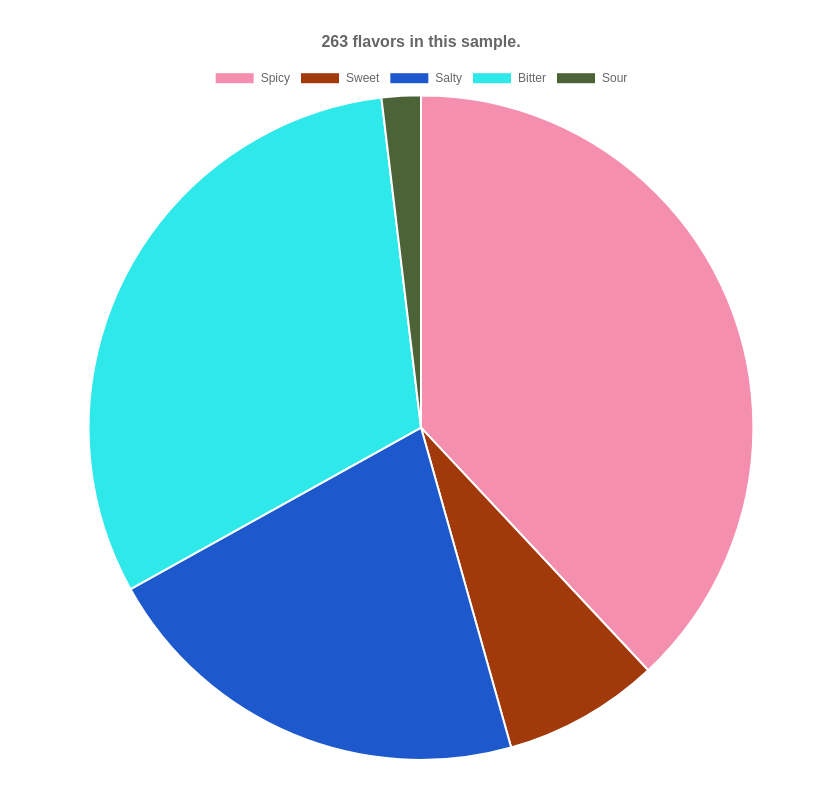

## Writing report submodules

A variety of basic reports are bundled with this module, but developers can add additional reports by writing submodules that provide data source plugins. Submodule can add functionality such as custom input form as well. In addition, submodules can package reports that are specific to a site (or shared!), and mangage dependencies on third-part Drupal modules.

The most typical source for report data is Drupal's database, but although source plugins can get their data from Solr, Blazegraph, or log files on disk (for example). The examples submodule provides several sample plugins:

* "Flavors", a very simple example module for developers
* "People currently in space", which demonstrates how a report can get data from a remote API
* a report of randomly generated pie chart data
* a report of randomly generated bar chart data
* a sample report that generates HTML markup instead of data for a Chart.js chart

### Module requirements

The minimum requirements for a submodule that provides a data source plugin are:

1. a .info.yml file
1. a .services.yml file
1. a plugin class file
1. a .module file containing any standard Drupal hook implementations, such as `hook_form_form_id_alter()`.

### Data Source plugins

Each report gets its data from a single data source plugin, which is a small PHP class file implementing the `IslandoraRepositoryReportsDataSourceInterface` that returns from its `getData()` method an associative array of label => count pairs, and, optionally, populate the `csvData` property. To illustrate how a data source plugin works, let's look at the one in the Flavors sample module. The data returned by this sample method is hard-coded, but the data could come from a database query, or a call to an external service:

```php
  /**
   * This is from the 'Flavors' sample data source plugin.
   *
   * @return array
   *   An assocative array containing dataLabel => count members.
   */
  public function getData() {
    $flavors = [
      'Spicy' => 100,
      'Sweet' => 20,
      'Salty' => 56,
      'Bitter' => 82,
      'Sour' => 5,
    ];

    $this->csvData = [[t('Flavor'), 'Count']];
    foreach ($flavors as $flavor => $count) {
      $this->csvData[] = [$flavor, $count];
    }

    return $flavors;
  }
```

That's all the `getData()` method in a data source plugin has to do. This one populates a chart that looks like this:



Code in submodules does not interact with the Chart.js JavaScript directly. All plugins need to do is have their `getData()` method return an array of data and populate `csvData` (which is not returned but is a property of the data source instance). Code in `islandora_repository_reports_hook_page_attachments()` passes the data to a JavaScript file that instantiates a Chart.js chart. The chart visualizing the data can be either a Chart.js [pie](https://www.chartjs.org/samples/latest/charts/pie.html) or [bar](https://www.chartjs.org/samples/latest/charts/bar/vertical.html) chart. Both chart types only support a single data series.

Each data source plugin class is called as a Drupal service, which is why plugins needs to be accompanied by a .services.yml file. Within the .services.yml file, the service ID must be in the form `islandora_repository_reports.datasource.xxx`, where `xxx` is an ID string specific to the plugin. This pattern ensures that the plugin will show up in the list of media formats reports in the select list in the reports form. For example, 'flavors' is the data source ID in this example:

```yaml
services:
  islandora_repository_reports.datasource.flavors:
    class: Drupal\islandora_repository_reports_datasource_sample\Plugin\DataSource\Flavors
```

### Data Source plugins that do not use Chart.js

Even though the focus of the Islandora Repository Reports module is producing visualizations of data, data source plugins can also generate HTML markup (more accurately, a Drupal render array) that is displayed to the user instead of Chart.js charts. One way to use this type of plugin is to render HTML that pulls in existing content from elsewhere, like the Matomo data source plugin does. This type of plugin can also render HTML tables, for example, if that presentation best suites the data.

## Modifying the report selection form

One quirky aspect of Repository Reports submodules that may not be easy to understand by looking at source code is how they modify the report selection form (`admin/reports/islandora_repository_reports`). This is done in a standard Drupal way, via an implementation of `hook_form_form_id_alter()`, e.g., `YOUR_MODULE_form_islandora_repository_reports_report_selector_alter()`. The quirky aspect is how the form state is passed from the form to the data source plugin services.

On submit, the report selection form's state is automatically stored in the user's session (technically speaking, in their Drupal tempstore). It is then retrieved from there by the data source plugin and used in the query that assembles the data for the report. To simply this process, the Repository Reports Utils class provides a helper method, `getFormElementDefault($form_element, $default_value)`. To illustrate how this works, let's look at the implementation of `hook_form_form_id_alter()` in the System Log Datasource module, available in [modules/islandora_repository_reports_log/islandora_repository_reports_log.module](../modules/islandora_repository_reports_log/islandora_repository_reports_log.module).

This hook implmenetation is pretty standard in that it adds an element to an existing form. The line

```php
$facet = $utilities->getFormElementDefault('islandora_repository_reports_log_facet', 'type');
```

retrieves the value of the user's selection in the specified form element ('islandora_repository_reports_log_facet') from the tempstore, or, if the tempstore doesn't contain the requested form state value, assigns a default value (in this case, 'type').

In the data source plugin's `getData()` method, that value is then retrieved in exactly the same way:

```php
  $facet = $utilities->getFormElementDefault('islandora_repository_reports_log_facet', 'type');
```

where it is used in the query against Drupal's database to retrieve the report data.

An aspect of Drupal's Form API that you will want to use is its [states](https://www.drupal.org/docs/8/api/form-api/conditional-form-fields) property. A common pattern in Repository Reports submodules is to selectively show a form element based on the value of the `islandora_repository_reports_report_type` form element. For example, the Random Datasource for Bar Charts module only shows the form element `islandora_repository_reports_datasource_random_bar_num_data` when the report type value `random_bar` is selected by the user:

```php
  $form['islandora_repository_reports_datasource_random_bar_num_data'] = [
    '#type' => 'textfield',
    '#weight' => 0,
    '#size' => 5,
    '#default_value' => $num_data_elements,
    '#maxlength' => 10,
    '#title' => t('Number of data elements'),
    '#description' => t('The number of random data elements to show in this chart.'),
    '#states' => [
      'visible' => [
        ':input[name="islandora_repository_reports_report_type"]' => ['value' => 'random_bar'],
      ],
    ],
  ];
``` 

Any submodule that adds its own form elements, or removes an existing form element (like the "Generate a CSV file of this data" checkbox), will use use the Form API states property.

## Modifying the admin settings form

Submodules can add their own configuration settings to the form at `admin/config/islandora/islandora_repository_reports` by implementing `hook_form_form_id_alter()`. The same hook implementation that adds fields to the config settings form should define its own configuration using `\Drupal::config('mysubmodule.settings')` and add a custom submit handler; in that hanlder, an instance of `\Drupal::configFactory('mysubmodule.settings')` can then be used to save the form values. See `islandora_repository_reports_activemq.module` for a working example.

## Pregenerating your data

The Drush command provided with this module will automatically detect your data source plugin (another useful benefit of implementing plugins as Drupal services). You do not need to do anything for this to happen.
