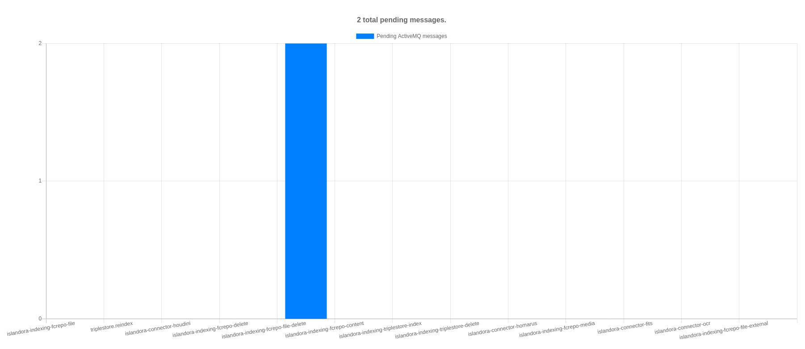

# ActiveMQ Data Source Plugin for Islandora Repository Reports

Data source plugin for the Islandora Repository Reports module that shows pending (i.e., waiting to be delivered to a microservice) messages in the message queue. For example, this report shows two messages pending in the `islandora-indexing-fcrepo-file-delete` queue:

This report is not a replacement for the output provided by the ActiveMQ admin interface at http://localhost:8161/admin/queues.jsp, it's just a simple overview of the number of pending messages in each queue.

## Requirements

* [Islandora Repository Reports](https://github.com/mjordan/islandora_repository_reports)

## Installation

Enable the module either under the "Admin > Extend" menu or by running `drush en -y islandora_repository_reports_datasource_activemq`.

## Configuration

Visit `/admin/config/islandora/islandora_repository_reports`.

## Current maintainer

* [Mark Jordan](https://github.com/mjordan)

## License

[GPLv2](http://www.gnu.org/licenses/gpl-2.0.txt)
